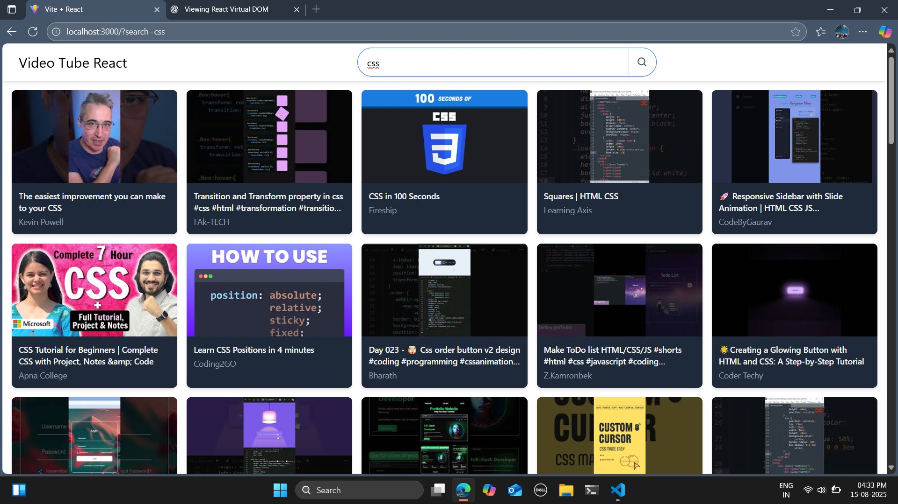

# 🚀 My React + Vite Project

A modern web application built with **React**, **Vite**, **Redux**, and **Tailwind CSS** for fast performance, state management, and beautiful styling.

---

## 📸 Preview


---

## 🛠️ Tech Stack
- **React** – UI library
- **Vite** – Next-generation frontend tooling
- **Redux Toolkit** – State management
- **Tailwind CSS** – Utility-first CSS framework
- **JavaScript / ES6+**

---

## 📂 Project Structure
```plaintext
my-project/
├── public/                 # Public assets (favicon, etc.)
├── src/                    # Main source code
│   ├── assets/             # Images, icons, and static files
│   ├── components/         # Reusable UI components
│   ├── pages/              # Page components (routes)
│   ├── store/              # Redux store & slices
│   ├── styles/             # Global styles (Tailwind base)
│   ├── App.jsx             # Main App component
│   ├── main.jsx            # React entry point
│   └── index.css           # Tailwind CSS entry file
├── .gitignore
├── package.json
├── postcss.config.js
├── tailwind.config.js
├── vite.config.js
└── README.md
